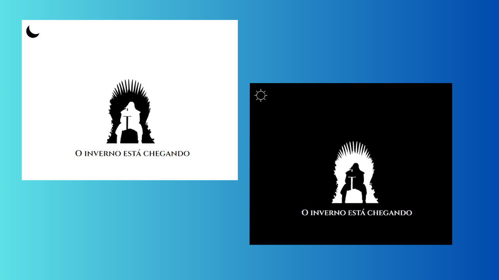

<h1 align="center"> Dark-Mode-GOT </h1>

Repositório do treinamento "JavaScript: implementando modo dark " promivido pela Alura Cursos Online.

  <a href="#-tecnologias">Tecnologias</a>&nbsp;&nbsp;&nbsp;|&nbsp;&nbsp;&nbsp;
  <a href="#-projeto">Projeto</a>&nbsp;&nbsp;&nbsp;|&nbsp;&nbsp;&nbsp;
  <a href="#-link">Link</a>&nbsp;&nbsp;&nbsp;|&nbsp;&nbsp;&nbsp;
  <a href="#%EF%B8%8F-licença">Licença</a>&nbsp;&nbsp;&nbsp;|&nbsp;&nbsp;&nbsp;

  

 

  

## 🚀 Tecnologias

Esse projeto foi desenvolvido com as seguintes tecnologias:

- HTML
- CSS
- JavaScript

## 💻 Projeto

Esse projeto é um treinamento utilizando JavaScript implementando modo dark.

## 🔗 Link

https://ofelia-1985.github.io/DarkModeAlura/

## 🗝️ Licença

Esse projeto está sob a licença MIT.

---

Feito com ♥ 
